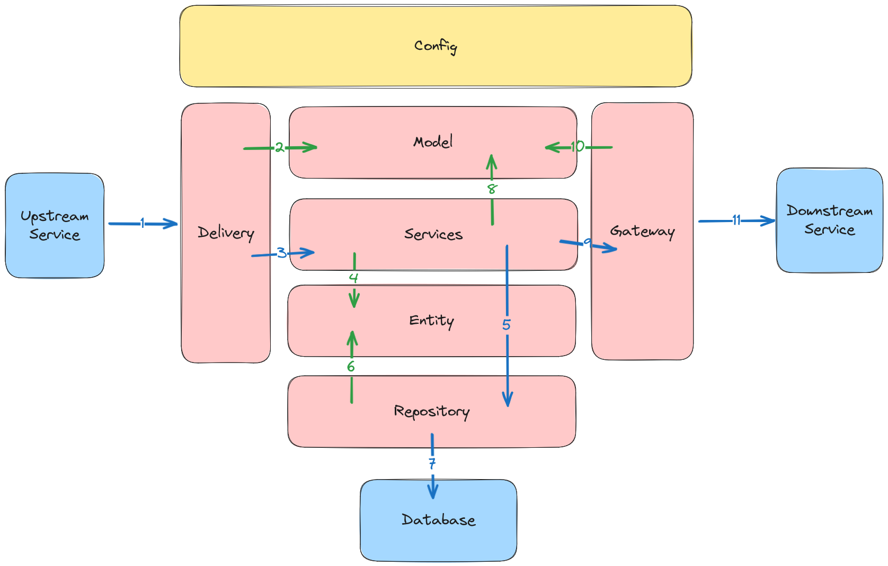

# API Documentation

## Description

This is API Documentation of simple crud api

## Architecture


(For this case is delivery only / web/main.go)
1. External system perform request (HTTP, gRPC, Messaging, etc)
2. The Delivery creates various Model from request data
3. The Delivery calls Use Case, and execute it using Model data
4. The Use Case create Entity data for the business logic
5. The Use Case calls Repository, and execute it using Entity data
6. The Repository use Entity data to perform database operation
7. The Repository perform database operation to the database
8. The Use Case create various Model for Gateway or from Entity data
9. The Use Case calls Gateway, and execute it using Model data
10. The Gateway using Model data to construct request to external system
11. The Gateway perform request to external system (HTTP, gRPC, Messaging, etc)

## Tech Stack

- Golang : https://github.com/golang/go
- Postgres (Database) : [https://github.com/mysql/mysql-server](https://github.com/glebarez/sqlite)

## Framework & Library

- Gin (HTTP Framework) : https://github.com/gin-gonic/gin
- GORM (ORM) : https://github.com/go-gorm/gorm
- Viper (Configuration) : https://github.com/spf13/viper
- Go Playground Validator (Validation) : https://github.com/go-playground/validator

## API Spec

All API Spec is in [here](./docs/swagger.json)

### Access Docs

after running:
- http://localhost:9004/swagger/index.html


## Run Application

### Run unit test

```bash
go test -v ./test/
```

### Run web server (local)

```bash
"copy .env.example as .env"
go run cmd/web/main.go
```

### Run via Docker compose

```bash
docker compose up -d
```


